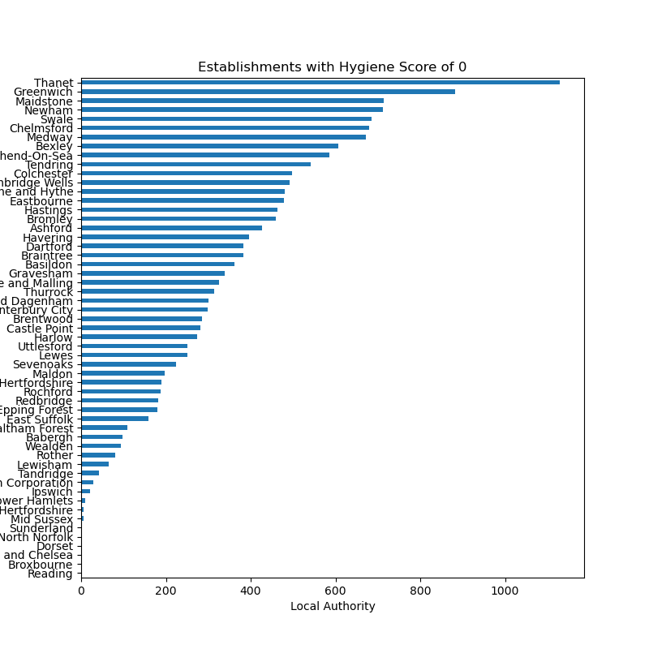

# Restaurants database (MongoDB)
## File structure
- `NoSQL_setup.ipynb`: Jupyter notebook used to setup the database and add new restaurant
- `NoSQL_analysis.ipynb`: Jupyter notebook used for the analysis
- `Resources`: Directory containing the JSON file used to set up the database

## Importing database from the JSON file
Use the following command line from the root directory:
```
mongoimport --type json -d uk_food -c establishments --drop --jsonArray Resources/establishments.json
```

## Answer to questions (analysis)
### 1. Which establishments have a hygiene score equal to 20?
There are 41 establishments with a Hygiene Score of 20

### 2. Which establishments in London have a `RatingValue` greater than or equal to 4?
There are 33 establishments in London with a Rating Value >= 4

There are 37 establishments in London in total.
- One is awaiting inspection: Froottree
- Three have ratings lower than 4: Gourmet Kitchen (3), Pret A Manger (2) and Cabin Bar (2)


### 3. What are the top 5 establishments with a `RatingValue` rating value of '5', sorted by lowest hygiene score, nearest to the new restaurant added, "Penang Flavours"?
The businesses are:
1. Iceland
2. Howe and Co Fish and Chips - Van 17
3. Volunteer
4. Plumstead Manor Nursery
5. Atlantic Fish Bar

### 4. How many establishments in each Local Authority area have a hygiene score of 0?
The Local Authorities with the most establishments are:
1. Thanet (1130 establishments)
2. Greenwich (882 establishments)
3. Maidstone (713 establishments)

These and the other Local Authorities are shown in the chart below.


